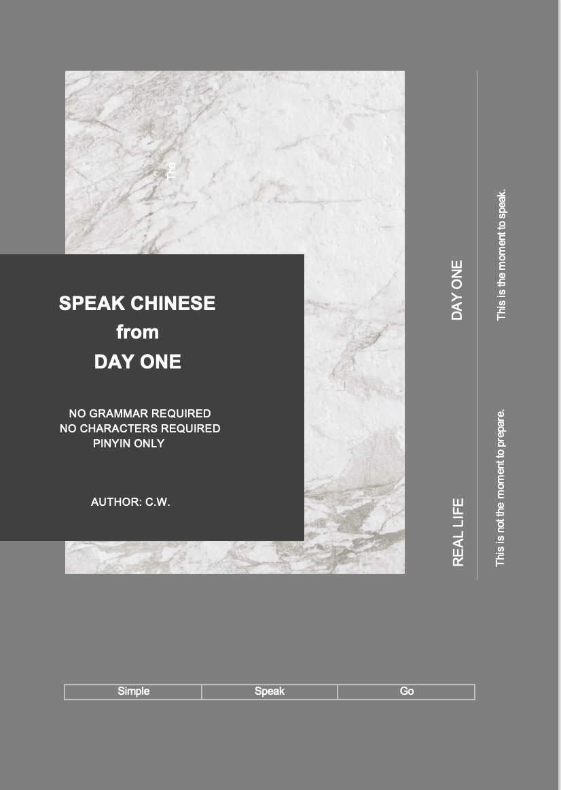

# Speak Chinese from Day One  
### Visual Learning Resources for Chinese Beginners

Learn Chinese characters and pronunciation through **visual recognition**.

This repository provides image resources for the book:

**Speak Chinese from Day One**

The images are designed to help beginners quickly connect:

**Chinese Characters → Pinyin → Meaning**

---

## About This Project

Chinese characters can feel intimidating at first.

Instead of memorizing abstract symbols, this project helps learners **see characters, recognize them visually, and connect them to pronunciation and meaning**.

These images are designed to work together with the **PinyinVision** learning approach.

---

## Table of Contents

Introduction

### Chapter 1 – Don’t Think. Just Start.
1. How Chinese Sentences Actually Work  
2. Is Chinese Hard? (Only If You Study It the Wrong Way)  
3. What Actually Matters for Beginners: The 20% That Gets You 80% of Results  
4. Chinese Word Order: Simple and Familiar as English  
5. Tones: Important, Not Paralyzing  
6. What to Focus On (and What to Ignore)

### Chapter 2 – Pinyin Made Simple
1. What Is Pinyin and Why It Helps  
2. Initials (Shēngmǔ / Consonants)  
3. Finals (Yùnmǔ / Vowels)  
4. Tones and the Five-Degree Notation System

### Chapter 3 – Essential Survival Sentences  
### Chapter 4 – Greeting People & Being Polite  
### Chapter 5 – Ordering Food & Drinks  
### Chapter 6 – Transportation & Getting Around  
### Chapter 7 – Shopping & Money  
### Chapter 8 – At Work (Basic Office Chinese)  
### Chapter 9 – Making Friends & Small Talk  
### Chapter 10 – Emergencies & Health  
### Chapter 11 – Talking on the Phone  
### Chapter 12 – Hotels, Housing & Daily Problems  
### Chapter 13 – Online Shopping Survival Chinese  
### Chapter 14 – Review & Next Steps  

### A Letter to the Reader

---

## Image Resources

This repository contains visual learning materials used in the book.

### Included Learning Materials

- Chinese **initials (声母)**
- Chinese **finals (韵母)**
- Chinese **tones (声调)**
- Chinese **basic vocabulary**
- Chinese **character learning examples**

These visual materials help learners connect:

**Character → Sound → Meaning**

All images are free to download for learning and educational use.

---

## Folder Structure

images/
initials/
finals/
words/

Each folder contains learning images designed for beginners.

---

## Example

Each folder contains learning images designed for beginners.

---

## Usage

You can use these images to:

• practice character recognition  
• learn pinyin pronunciation  
• support beginner Chinese courses  
• build Chinese learning tools

Learners can download the images and practice reading Chinese with pinyin.

---

## License

Free for **learning and educational use**.

For research or educational projects, please cite the repository.

---

# 中文说明

本仓库提供《Speak Chinese from Day One》书籍的配套学习图片资源。

图片内容包括：

- 汉语声母
- 汉语韵母
- 汉语声调
- 基础词汇图片
- 汉字学习示例

这些图片用于帮助学习者建立：

汉字 → 拼音 → 含义

之间的视觉联系。

学习者可以免费下载用于中文学习。
